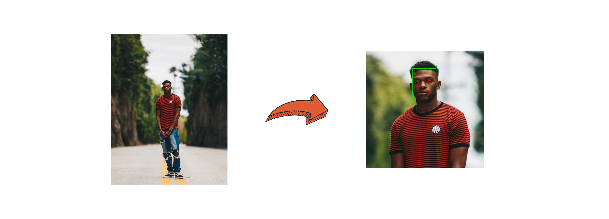

# `facecrop.rs`


## About 

FaceCrop is a CLI tool I originally wrote to extract crops of all faces within directory of images for stable diffusion training. I've generated out this README in case for posterity. 

The crops are calculated based on the face bounding box and can be either absolute (pixels) or relative to the face size (proportion of the face height to crop). Each crop is then optionally resized to the given size and/or filtered out.

## Features



- **Flexible Cropping Strategies**: Choose between absolute or relative cropping strategies.
- **Customizable Aspect Ratio**: Define the aspect ratio for the crop.
- **Padding Options**: Adjust the top padding for the crop.
- **Resizing**: Resize images to a given height and width
- **Size Filtering**: Filter out crops that are smaller than the specified height and width.

## Usage

To use FaceCrop, you need to provide the following arguments:

```
Usage: facecrop [OPTIONS] <IMAGE_PATH_OR_DIR> <OUTPUT_DIR>

Arguments:
  <IMAGE_PATH_OR_DIR>  Path to the image file or directory to process
  <OUTPUT_DIR>         Path to write output files to

Options:
  -s, --strategy <STRATEGY>
          Strategy to use to crop faces. This can either be "absolute" or "relative" [default: relative] [possible values: absolute, relative]
  -a, --aspect_ratio <ASPECT_RATIO>
          Aspect ratio (width:height) to crop the image by. 1.0 indicates a square crop while 1.5 indicates a crop that is 1.5 times as wide as it is tall [default: 1.0]
  -t, --top-padding <TOP_PADDING>
          Top padding. Portion of the image that should be padded on top of the face This is a float between 0.0 and 1.0 [default: 0.1]
  -p, --proportion-of-face <PROPORTION_OF_FACE>
          Portion of the image that the face should take up vertically (from the top) This is a float between 0.0 and 1.0 [default: 0.3]
      --height <HEIGHT>
          Height of the crop. Used to determine the crop dimensions if strategy="absolute". If strategy="relative" and resize=true, the cropped image will be resized to this height [default: 1024]
      --width <WIDTH>
          Width of the crop. Used to determine the crop dimensions if strategy="absolute". If strategy="relative" and resize=true, the cropped image will be resized to this width [default: 1024]
  -r, --resize
          True to resize the cropped image to the specified height and width. False to leave the cropped image at the original size
  -f, --filter-by-size
          True to filter out crops that are smaller than the specified height and width. False to output all crops
  -v, --verbose...
          Verbosity
  -h, --help
          Print help
  -V, --version
          Print version
```

### Examples

#### Crop by Proportion of Face & Resize

```bash
facecrop ./images ./output \
    --strategy relative \
    --aspect_ratio 1.0 \
    --top_padding 0.1 \
    --proportion_of_face 0.3
```

#### Crop by Proportion of Face & Resize

```bash
facecrop ./images ./output \
    --strategy relative \
    --aspect_ratio 1.0 \
    --top_padding 0.1 \
    --proportion_of_face 0.3 \
    --height 1024 \
    --width 1024 \
    --resize \
    --filter_by_size \
```

#### Crop by Pixels

```bash
facecrop ./images ./output \
    --strategy absolute \
    --top_padding 0.1 \
    --height 1024 \
    --width 1024 \
    --filter_by_size \
```

## Installation

To install FaceCrop, you need to have Rust installed on your machine. Once you have Rust installed, you can clone this repository and build the project using `cargo build --release`.

## Contributing

Contributions are welcome! Please feel free to submit a Pull Request.

## License

FaceCrop is licensed under the MIT license.